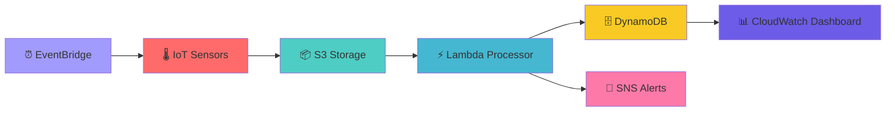

# 🌱 EcoMonitor - IoT Environmental Monitoring System

<div align="center">

[](https://aws.amazon.com/)
[](https://terraform.io/)
[](https://python.org/)
[](https://aws.amazon.com/iot/)

*A comprehensive serverless IoT environmental monitoring solution built on AWS*

[🚀 Quick Start](#-quick-start) • [📊 Dashboard](#-dashboard-access) • [🏗️ Architecture](#-architecture) • [📖 Documentation](#-documentation)

</div>

---

## 🎯 Overview

EcoMonitor is a robust, serverless IoT environmental monitoring system that collects, processes, and visualizes environmental sensor data in real-time. Built with AWS services and infrastructure-as-code principles, it provides comprehensive monitoring for temperature, humidity, air quality index (AQI), and CO2 levels.

### ✨ Key Highlights

- 🌡️ **Multi-Sensor Support**: Temperature, Humidity, AQI, and CO2 monitoring
- ☁️ **Serverless Architecture**: Built entirely on AWS Lambda and managed services
- 📊 **Real-time Dashboards**: Interactive CloudWatch dashboards with custom metrics
- 🔔 **Smart Alerting**: Automated notifications for threshold breaches and system errors
- 🚀 **Auto-Scaling**: Handles varying workloads without manual intervention
- 💰 **Cost-Effective**: Pay-per-use model with optimized resource utilization

## 🏗️ Architecture



### 🔄 Data Flow

1. **Sensor Simulation** 🌡️ → EventBridge triggers Lambda functions every 5 minutes
2. **Data Collection** 📦 → Sensor data is published to IoT Core and stored in S3
3. **Processing** ⚡ → S3 events trigger processing Lambda to clean and transform data
4. **Storage** 🗄️ → Processed data is stored in DynamoDB with optimized indexing
5. **Visualization** 📊 → CloudWatch dashboards display real-time metrics and trends
6. **Alerting** 🔔 → SNS notifications for errors and threshold violations

## 🌟 Features

### 📊 Comprehensive Monitoring
- **Real-time Data Pipeline**: Live monitoring of S3 → DynamoDB transfers
- **Processing Metrics**: Files processed per minute with success/error ratios
- **Sensor Analytics**: Individual tracking for each sensor type
- **Performance Insights**: Lambda execution times and throughput analysis

### 🎨 Rich Visualizations
- **Interactive Dashboards**: Time-series graphs, single-value metrics, and log analysis
- **Health Monitoring**: System status with visual indicators
- **Trend Analysis**: Historical data patterns and capacity planning
- **Error Tracking**: Detailed breakdown of processing failures

### 🔧 Operational Excellence
- **Infrastructure as Code**: Complete Terraform automation
- **Automated Deployment**: One-command setup and configuration
- **Comprehensive Logging**: Enhanced logs with emoji indicators for easy troubleshooting
- **Custom Metrics**: CloudWatch metrics for detailed monitoring

## 🚀 Quick Start

### 📋 Prerequisites

- **AWS CLI** configured with appropriate permissions
- **Terraform** v1.0+ installed
- **AWS Account** with IoT Core, Lambda, S3, DynamoDB, and CloudWatch access

### ⚡ One-Command Deployment

```bash
# Clone the repository
git clone <repository-url>
cd EcoMonitor

# Navigate to Terraform directory
cd Terraform/

# Initialize and deploy
terraform init
terraform plan
terraform apply
```

### 🔧 Configuration

1. **IoT Endpoint Setup**:
   ```bash
   # Find your IoT endpoint
   aws iot describe-endpoint --endpoint-type iot:Data-ATS
   ```

2. **Update Lambda Environment**:
   - Set `IOT_ENDPOINT` in Lambda environment variables
   - Format: `your-endpoint.iot.region.amazonaws.com` (without https://)

### 🎛️ Alternative Deployment Options

#### Option 1: Automated Script
```bash
cd Terraform/
./scripts/deploy-dashboard.sh deploy
```

#### Option 2: Manual Steps
```bash
terraform init
terraform plan -out=tfplan
terraform apply tfplan
```

#### Option 3: Validation
```bash
./scripts/deploy-dashboard.sh status
```

## 📊 Dashboard Access

### 🌐 CloudWatch Dashboard

Access your monitoring dashboard:
```
https://us-east-1.console.aws.amazon.com/cloudwatch/home?region=us-east-1#dashboards:name=EcoMonitor-Data-Pipeline
```

### 📈 Dashboard Layout

```
┌─────────────────────────────────────────────────────────────┐
│                    🌱 ECOMONITOR OVERVIEW                   │
├─────────────────┬─────────────────┬─────────────────────────┤
│   📊 Processing │   ⚡ Lambda     │    🌡️ Sensor Types     │
│   Metrics       │   Performance   │   (Temp, Humidity,      │
│   (Success/Err) │   (Duration,    │    AQI, CO2)           │
│                 │    Invocations) │                         │
├─────────────────┼─────────────────┼─────────────────────────┤
│  📦 S3 Bucket   │  📄 Object      │  🗄️ DynamoDB Items     │
│  Size           │  Count          │                         │
├─────────────────────────────────────────────────────────────┤
│              📝 RECENT ACTIVITY LOGS                        │
│         (Filtered for SUCCESS/ERROR messages)              │
├─────────────────┬───────────────────────────────────────────┤
│  🤖 IoT Devices │         ❌ Error Analysis                 │
│  Activity       │      (Types and Trends)                  │
└─────────────────┴───────────────────────────────────────────┘
```

## 📁 Project Structure

```
EcoMonitor/
├── 📁 Terraform/                      # Infrastructure as Code
│   ├── 📄 Provider.tf                 # AWS provider configuration
│   ├── 📄 Networking.tf               # VPC and networking setup
│   ├── 📄 lambda.tf                   # Lambda functions and permissions
│   ├── 📄 s3.tf                       # S3 bucket configuration
│   ├── 📄 Dynamo.tf                   # DynamoDB table setup
│   ├── 📄 IoT Core.tf                 # IoT Core configuration
│   ├── 📄 sns.tf                      # SNS topics and subscriptions
│   ├── 📄 cloudwatch_dashboard.tf     # Dashboard and monitoring
│   ├── 📄 sensor_insights_dashboard.tf # Advanced sensor analytics
│   │
│   ├── 📁 IoT devices/                # Sensor simulators
│   │   ├── 🌡️ Temprature.py          # Temperature sensor
│   │   ├── 💧 Humidity.py             # Humidity sensor
│   │   ├── 🏭 AQI.py                  # Air Quality Index sensor
│   │   └── 🫁 Co2.py                  # CO2 sensor
│   │
│   ├── 📁 data cleaner/               # Data processing
│   │   ├── 🧹 s3_to_dynamo.py         # S3 to DynamoDB processor
│   │   └── 🔧 python.py               # Utility functions
│   │
│   ├── 📁 lambda_packages/            # Deployment packages
│   │   ├── 📦 temperature_function.zip
│   │   ├── 📦 humidity_function.zip
│   │   ├── 📦 aqi_function.zip
│   │   ├── 📦 co2_function.zip
│   │   └── 📦 s3_to_dynamo_function.zip
│   │
│   ├── 📁 provisioning/               # Dashboard templates
│   │   └── 📁 dashboards/
│   │       ├── 📄 README.md
│   │       └── 📁 ecomonitor-dashboards/
│   │           ├── 📊 cloudwatch-dashboard.json
│   │           └── 📈 data-pipeline-dashboard.json
│   │
│   └── 📁 scripts/                    # Deployment utilities
│       └── 🚀 deploy-dashboard.sh
│
├── 📄 DASHBOARD_IMPLEMENTATION.md     # Detailed implementation guide
├── 📄 Readme.md                       # This file
└── 📄 terraform.tfstate               # Terraform state (auto-generated)
```

## 🔍 Monitoring & Metrics

### 📈 Key Performance Indicators

| Metric Category | Description | Visualization |
|----------------|-------------|---------------|
| **🔄 Pipeline Health** | Files processed, success ratios, error rates | Time series & stacked charts |
| **💾 Storage Analytics** | S3 usage, object counts, DynamoDB capacity | Single value metrics |
| **⚡ Performance** | Lambda duration, invocation rates | Multi-line graphs |
| **🌡️ Sensor Data** | Temperature, humidity, AQI, CO2 readings | Individual sensor dashboards |

### 🚨 Automated Alerting

- **Lambda Errors**: Triggers when > 5 errors in 10 minutes
- **DynamoDB Throttling**: Alerts on throttled requests
- **Processing Failures**: Monitors overall failure rates
- **Threshold Violations**: Custom alerts for sensor readings

## 🛠️ Advanced Configuration

### 🔧 Custom Metrics

The system publishes custom CloudWatch metrics:

```python
# Example custom metrics
- EcoMonitor/DataPipeline/SuccessfulTransfers
- EcoMonitor/DataPipeline/DataProcessedSuccessfully
- EcoMonitor/SensorData/TemperatureReading
- EcoMonitor/SensorData/HumidityReading
```

### 📊 Dashboard Customization

1. **Access Dashboard JSON**:
   ```bash
   cd Terraform/provisioning/dashboards/ecomonitor-dashboards/
   ```

2. **Modify Widgets**:
   - Edit `cloudwatch-dashboard.json`
   - Customize metrics, time ranges, and visualizations

3. **Deploy Changes**:
   ```bash
   terraform apply
   ```

## 🔒 Security & Best Practices

### 🛡️ Security Features

- **IAM Least Privilege**: Minimal required permissions for each service
- **S3 Encryption**: Server-side encryption enabled by default
- **VPC Security Groups**: Restricted network access
- **Public Access Blocking**: S3 buckets secured against public access

### 📋 Operational Best Practices

- **Lifecycle Policies**: Automated data archival after 90 days
- **Log Retention**: 14-day retention for processing logs, 7 days for sensors
- **Error Handling**: Comprehensive try-catch blocks with detailed logging
- **Resource Tagging**: Consistent tagging for cost allocation and management

## 🚨 Troubleshooting

### 🔍 Common Issues

<details>
<summary><b>Lambda Function Timeouts</b></summary>

**Problem**: Lambda functions timing out during processing

**Solution**:
```bash
# Increase timeout in Terraform
timeout = 30  # seconds
```
</details>

<details>
<summary><b>IoT Endpoint Not Set</b></summary>

**Problem**: Sensor data not reaching IoT Core

**Solution**:
```bash
# Get IoT endpoint
aws iot describe-endpoint --endpoint-type iot:Data-ATS

# Update Lambda environment variable
IOT_ENDPOINT=your-endpoint.iot.region.amazonaws.com
```
</details>

<details>
<summary><b>DynamoDB Throttling</b></summary>

**Problem**: Write throttling in DynamoDB

**Solution**:
- Check CloudWatch metrics for throttling
- Consider increasing write capacity units
- Implement exponential backoff in Lambda functions
</details>

### 📞 Support

For issues and questions:
1. Check CloudWatch logs for detailed error messages
2. Review the `DASHBOARD_IMPLEMENTATION.md` for detailed setup instructions
3. Validate IAM permissions for all services

## 📖 Documentation

- **📊 Dashboard Setup**: `Terraform/provisioning/dashboards/README.md`
- **🔧 Implementation Details**: `DASHBOARD_IMPLEMENTATION.md`
- **🏗️ Infrastructure**: Individual Terraform files in `Terraform/` directory

## 🤝 Contributing

Contributions are welcome! Please feel free to submit a Pull Request.

## 📄 License

This project is licensed under the MIT License - see the LICENSE file for details.

---

<div align="center">

**🌱 Built with ❤️ for environmental monitoring**

Made with AWS serverless technologies • Terraform • Python

</div>


